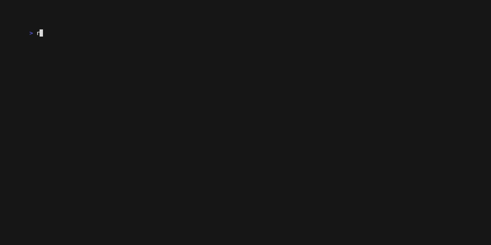
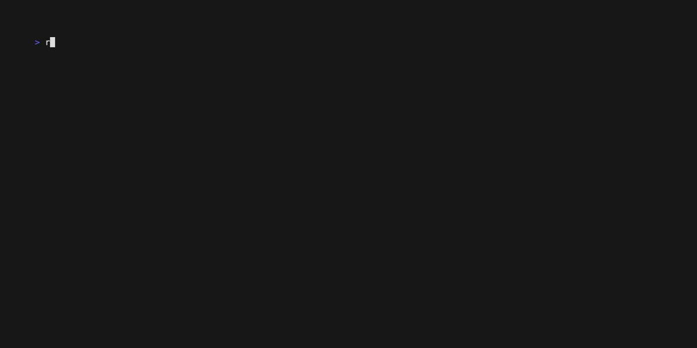

# Rockset CLI
[](https://github.com/rockset/cli/actions/workflows/build.yaml)
[](https://circleci.com/gh/rockset/cli)
[](http://godoc.org/github.com/rockset/rockset-go-cli)
[](https://github.com/rockset/rockset-go-cli/LICENSE)
[](https://github.com/rockset/rockset-go-cli/issues)
[](https://github.com/rockset/rockset-go-cli/releases)

## Usage

The Rockset cli can be used as an alternative to the [console](https://console.rockset.com/),
and is built as a UNIX tool to allow it to be used in pipes.



### Query



There are three ways to query a collection, either using the first argument as the SQL

```shell
$ rockset query 'SELECT COUNT(*) FROM _events'
+--------+
| ?COUNT |
+--------+
|   1016 |
+--------+
Elapsed time: 26 ms
```

Or using interactive mode

```shell
$ rockset query
[R]> SELECT COUNT(*)
>>> FROM _events;
+--------+
| ?COUNT |
+--------+
|   1016 |
+--------+
Elapsed time: 26 ms
^D
```

And reading the SQL from stdin

```shell
$ rockset query < query.sql
+--------+
| ?COUNT |
+--------+
|   1016 |
+--------+
Elapsed time: 26 ms
```

### Cloning a collection

A common workflow is to want to clone a collection, but change a few settings, e.g. the retention.
This can be done using two commands

```shell
rockset get collection --output - movies | rockset create collection --input - --retention 12h movies2
```


## Configuration

The Rockset CLI requires having access to either an API key or a bearer token, together with an apiserver,
and in the case of a bearer token also the organization.

These are called authentication context.

The easiest way to authenticate is using the console login, which is invoked using
```shell
$ rockset auth login
```

The authentication token is valid for 24h, and can be refreshed using

```shell
$ rockset auth refresh
```

To view which authentication contacts are available

```shell
$ rockset list contexts
Available Authentication Contexts:
apikeys:
   dev (https://api.usw2a1.dev.rockset.com)
   test (https://api.use1a1.rockset.com)
bearer tokens:
-> usw2a1 (https://api.usw2a1.rockset.com)
$ rockset use context prod
using prod
$ rockset list contexts
Available Authentication Contexts:
apikeys:
   dev (https://api.usw2a1.dev.rockset.com)
-> test (https://api.use1a1.rockset.com)
bearer tokens:
   usw2a1 (https://api.usw2a1.rockset.com)
```

### Configuration File

The configuration file is stored in `~/.config/rockset/config.yaml`

```yaml
---
current: dev
keys:
  dev:
    apikey: ...
    apiserver: api.usw2a1.dev.rockset.com
tokens:
  prod:
    token: ...
    org: rockset-test
    apiserver: api.usw2a1.dev.rockset.com
    expiration: 2023-10-17T08:13:48.785337-07:00
```

## Building

```
go build -o rockset
```

## Testing

```
go test ./...
```

### Integration testing

Requires the environment variable `ROCKSET_APIKEY` to be set

```
go test ./...
```

### Create recordings

We use [vhs](https://github.com/charmbracelet/vhs) to record terminal sessions

```
vhs vhs/demo.tape
```

